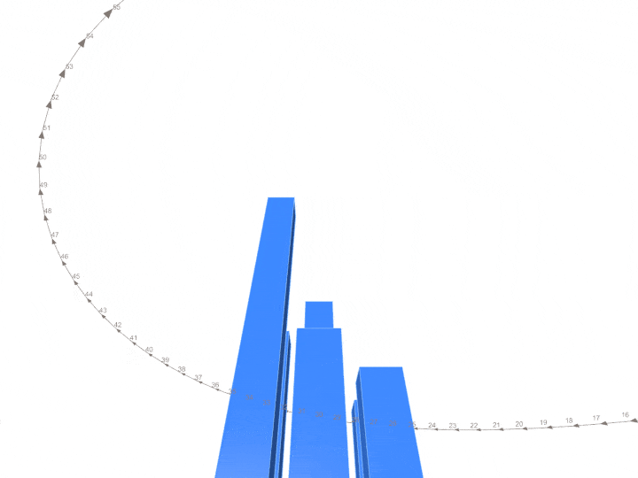
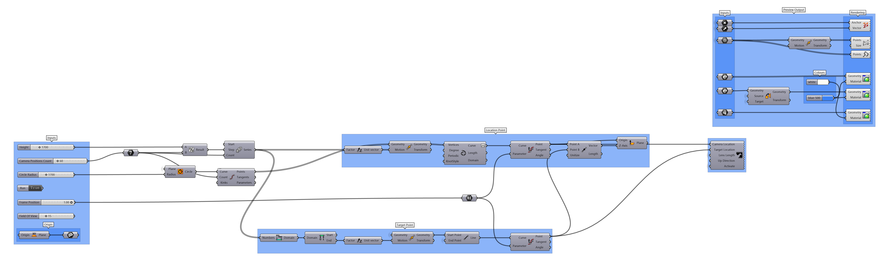

Sometimes, you may want to record the visual output of your script in a more controlled and repeatable way. While a simple screen recording can be a quick and convenient solution, adopting a programmatic approach offers greater flexibility. It allows you to easily tweak settings and re-record the same output without starting from scratch, ensuring consistent results every time.

# Introduction

If you're new to Grasshopper, you'll be pleased to know that with just a third-party plugin, you can effortlessly set up a dynamic camera pipeline. For more experienced users, leveraging the [Rhino API](https://developer.rhino3d.com/api/rhinocommon/) offers greater flexibility and enables the creation of more complex and customized implementations.

# Third-party implementation

Added in this folder are two third-party script implementations, one using [Horster](https://www.food4rhino.com/en/app/horster-camera-control-grasshopper) and a second using [Heteroptera](https://www.food4rhino.com/en/app/heteroptera).

